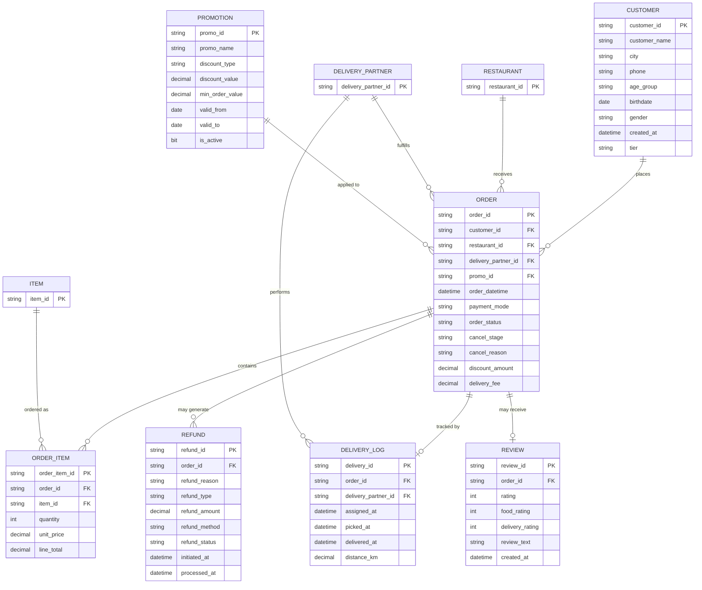
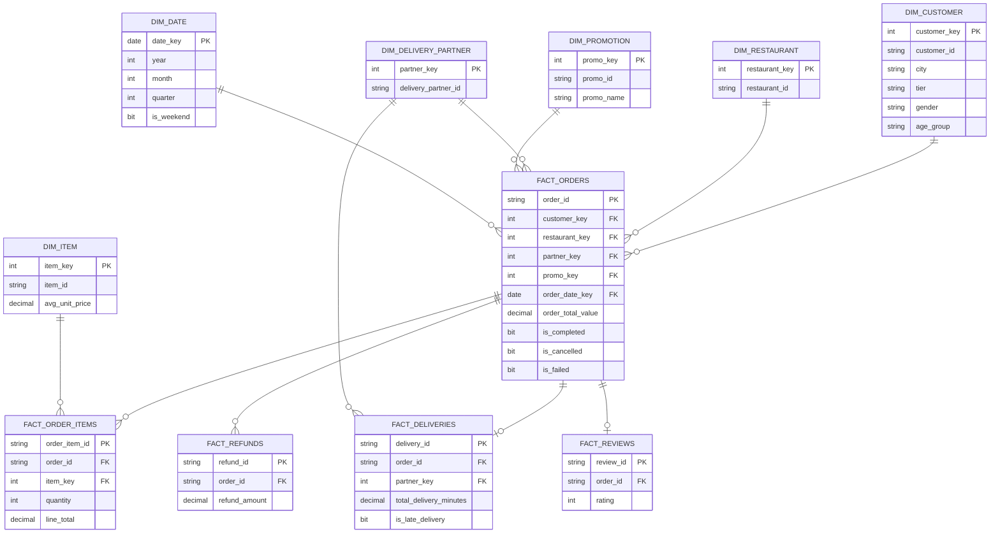

# Stage 0 — Prestage: Schema & Data Mapping, Normalization Rules, Denormalization, ERD
Project: Food Delivery CRM Analytics Pipeline
Source file: `Food_Delivery_CRM_Raw_Dataset.xlsx` (7 sheets, ~1.42M rows)
Target platform: Microsoft SQL Server (T-SQL)

This document is produced **before any table is created**. It answers three questions:
1. What does the source actually contain, and how does it map onto a target schema?
2. What normalization rules turn the flat source sheets into a clean relational (3NF) model?
3. What denormalized (star-schema) shape do we need for fast analysis, and how do the two relate (ERD)?

---

## 1. Source inventory

| Sheet | Rows | Grain | Business key |
|---|---|---|---|
| `orders` | 308,255 | 1 row per order | `order_id` |
| `order_items` | 610,787 | 1 row per order line | `order_item_id` |
| `customers` | 101,764 | 1 row per customer | `customer_id` |
| `delivery_logs` | 287,939 | 1 row per delivery attempt | `delivery_id` |
| `refunds` | 13,530 | 1 row per refund case | `refund_id` |
| `promotions` | 51 | 1 row per promo code | `promo_id` |
| `customer_reviews` | 114,059 | 1 row per review | `review_id` |

All 7 sheets are **already reasonably normalized at the entity level** (no repeating groups within a row), but they are flat CS26 exports with no declared keys, no types, and — as profiling in the sandbox showed — significant data-quality noise (garbage suffixes, sentinel values, duplicate business keys). That noise is handled in Stage 3; this stage only defines *structure*, not *cleaning*.

## 2. Source → target mapping & normalization rules

### 2.1 Entities identified (3NF core layer)
| Entity | Derived from | Notes |
|---|---|---|
| `Customer` | `customers` sheet | 1 row = 1 customer. Natural key `customer_id`. |
| `Restaurant` | `restaurant_id` column inside `orders` | **No restaurant master sheet exists.** Restaurant is a *foreign concept* referenced only by ID (50 distinct IDs). Normalized out into its own dimension so `orders` isn't repeating a bare code; no descriptive attributes are available beyond the ID — documented as a known source limitation. |
| `DeliveryPartner` | `delivery_partner_id` inside `orders`/`delivery_logs` | Same situation as Restaurant — 300 distinct IDs, no attribute table supplied. |
| `Item` (menu item) | `item_id` inside `order_items` | Same situation — 180 distinct IDs, no name/category/menu master supplied. |
| `Promotion` | `promotions` sheet | 1 row = 1 promo code, referenced by `orders.promo_id`. |
| `Order` | `orders` sheet | 1 row = 1 order header. References Customer, Restaurant, DeliveryPartner, Promotion. |
| `OrderItem` | `order_items` sheet | Child of Order (1:N). References Item. |
| `DeliveryLog` | `delivery_logs` sheet | Child of Order (1:1 in practice — one delivery attempt per order that reached dispatch). References DeliveryPartner. |
| `Refund` | `refunds` sheet | Child of Order (0:N — most orders have zero refunds). |
| `Review` | `customer_reviews` sheet | Child of Order (0:1). |

### 2.2 Column-level mapping (source → staging → core)

| Source table.column | Staging column (raw, `VARCHAR`) | Core column (typed, cleaned) | Transformation rule (applied in Stage 3) |
|---|---|---|---|
| orders.order_id | stg_orders.order_id | core_orders.order_id | TRIM |
| orders.customer_id | stg_orders.customer_id | core_orders.customer_id | TRIM |
| orders.restaurant_id | stg_orders.restaurant_id | core_orders.restaurant_id | TRIM |
| orders.order_datetime | stg_orders.order_datetime | core_orders.order_datetime | CAST to DATETIME2, blank→NULL |
| orders.payment_mode | stg_orders.payment_mode | core_orders.payment_mode | TRIM; NULL is a legitimate business state (order failed before payment capture) |
| orders.order_status | stg_orders.order_status | core_orders.order_status | strip injected `@@@/###/!!!` noise tokens → `{completed, cancelled, failed}` |
| orders.cancel_stage | stg_orders.cancel_stage | core_orders.cancel_stage | TRIM; NULL when order wasn't cancelled |
| orders.cancel_reason | stg_orders.cancel_reason | core_orders.cancel_reason | strip noise tokens; literal `"None"` → NULL |
| orders.delivery_partner_id | stg_orders.delivery_partner_id | core_orders.delivery_partner_id | TRIM |
| orders.promo_id | stg_orders.promo_id | core_orders.promo_id | strip noise tokens; literal `"None"` → NULL |
| orders.discount_amount | stg_orders.discount_amount | core_orders.discount_amount | sentinel `99999` → NULL + DQ flag |
| orders.delivery_fee | stg_orders.delivery_fee | core_orders.delivery_fee | sentinel `-1` → NULL + DQ flag |
| order_items.* | stg_order_items.* | core_order_items.* | quantity/unit_price sentinel recovery using `line_total` as source of truth (see Stage 3) |
| customers.phone | stg_customers.phone | core_customers.phone_clean | strip non `[+0-9]` characters, normalize to `+<countrycode><number>` |
| customers.age_group / gender | stg | core | strip noise tokens |
| customers.birthdate | stg | core | CAST to DATE |
| delivery_logs.distance_km | stg | core | sentinel `99999` → NULL + DQ flag |
| delivery_logs.assigned_at/picked_at/delivered_at | stg | core | CAST to DATETIME2; derive `pickup_lag_minutes`, `transit_minutes`, `total_delivery_minutes` |
| refunds.refund_method/status/type | stg | core | strip noise tokens; literal `"None"` → NULL |
| customer_reviews.rating / food_rating | stg | core | sentinel `99999` → NULL |
| customer_reviews.delivery_rating | stg | core | sentinel `-1` → NULL |
| promotions.promo_id | stg | core | strip noise tokens; malformed IDs flagged, not dropped |

Full column-by-column dictionary with data types lives in `docs/data_dictionary.md`.

### 2.3 Normalization rules applied
1. **1NF** — every staging column already holds a single atomic value (no CSV-in-a-cell); confirmed during profiling.
2. **2NF** — `order_items` attributes (`quantity`, `unit_price`, `line_total`) depend on the full key `(order_id, item_id)`, not on `order_id` alone — no partial dependency to remove.
3. **3NF** — `Restaurant`, `DeliveryPartner`, `Item`, `Promotion`, and `Customer` are extracted into their own tables so that non-key attributes never depend on another non-key attribute inside `orders`/`order_items` (e.g. promo discount rules live only in `Promotion`, not repeated on every order row).
4. **Business-key deduplication** — several source rows share the same business key with one corrupted copy (injected duplicate). Rule: keep the copy with the fewest NULLs/DQ flags, tie-break on first-seen order, and log every resolution to `dq_duplicate_log` (see Stage 3 §3).

## 3. Denormalization for analysis (star schema)

The 3NF core layer is correct but expensive to query for reporting (5–6 joins per business question). Stage 4 denormalizes it into a **star schema**:

- **Dimensions**: `dim_date`, `dim_customer`, `dim_restaurant`, `dim_delivery_partner`, `dim_item`, `dim_promotion`
- **Facts**: `fact_orders` (grain: 1 row/order), `fact_order_items` (grain: 1 row/order line), `fact_deliveries` (grain: 1 row/delivery), `fact_refunds` (grain: 1 row/refund), `fact_reviews` (grain: 1 row/review)

Facts pre-join the surrogate keys and pre-compute the derived measures analysts ask for repeatedly (`order_total_value`, `is_late_delivery`, `total_delivery_minutes`, `used_promo`, etc.), trading storage for query simplicity — the standard OLTP→OLAP denormalization trade-off.

## 4. Entity-Relationship Diagram

### 4.1 Core (3NF) relational model

### 4.2 Denormalized star schema (analysis layer)

## 5. Known source limitations (carried forward, not "fixed")
- **No Restaurant, DeliveryPartner, or Item master data** — only IDs exist in the source. `dim_restaurant`/`dim_delivery_partner`/`dim_item` therefore hold IDs plus any statistics we can *derive* (e.g. average item price), not descriptive attributes (name, cuisine, category). Any request for "restaurant name" or "item name" cannot be answered from this dataset.
- All other limitations (sentinels, duplicate keys, noise tokens) are **data-quality issues**, not schema issues, and are handled explicitly in Stage 3.
